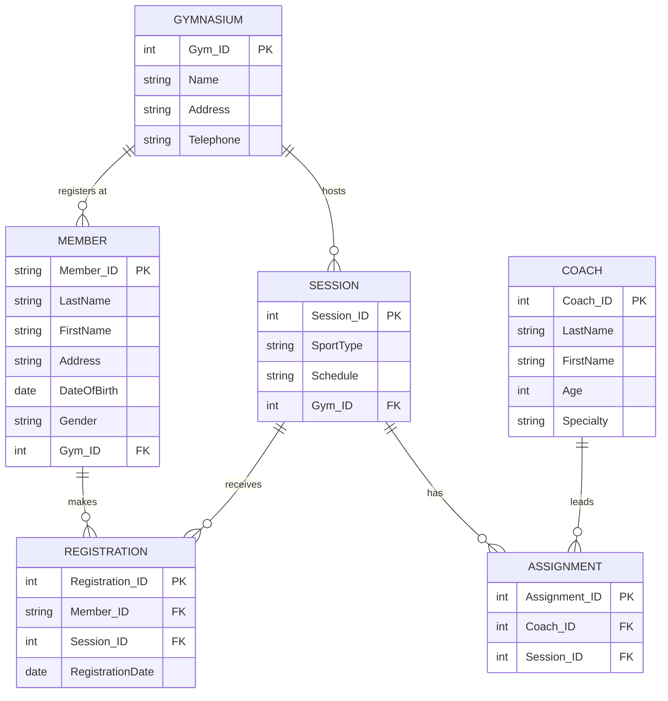

# Gym Chain — Entity-Relationship Model

Relational Databases assignment: ER model for a multi-site gym chain that manages members, sessions, and coaches.

## Scenario

A gym chain with several locations needs a database to replace manual card-based registration. Members register at one gym, sign up for sport sessions (max 20 participants), and sessions are led by up to two coaches.

## Entities and Attributes

### Gymnasium
| Attribute   | Type   | Constraint |
|-------------|--------|------------|
| Gym_ID      | int    | **PK**     |
| Name        | string | NOT NULL   |
| Address     | string | NOT NULL   |
| Telephone   | string | NOT NULL   |

### Member
| Attribute    | Type   | Constraint        |
|--------------|--------|-------------------|
| Member_ID    | string | **PK** (unique identifier) |
| LastName     | string | NOT NULL          |
| FirstName    | string | NOT NULL          |
| Address      | string | NOT NULL          |
| DateOfBirth  | date   | NOT NULL          |
| Gender       | string | NOT NULL          |
| Gym_ID       | int    | **FK** → Gymnasium |

### Session
| Attribute  | Type   | Constraint        |
|------------|--------|-------------------|
| Session_ID | int    | **PK**            |
| SportType  | string | NOT NULL          |
| Schedule   | string | NOT NULL          |
| Gym_ID     | int    | **FK** → Gymnasium |

### Coach
| Attribute | Type   | Constraint |
|-----------|--------|------------|
| Coach_ID  | int    | **PK**     |
| LastName  | string | NOT NULL   |
| FirstName | string | NOT NULL   |
| Age       | int    | NOT NULL   |
| Specialty | string | NOT NULL   |

### Registration (associative entity)
Links **Member** and **Session** (M:N). Prevents attending a session without registration.

| Attribute         | Type   | Constraint        |
|-------------------|--------|-------------------|
| Registration_ID   | int    | **PK**            |
| Member_ID         | string | **FK** → Member   |
| Session_ID        | int    | **FK** → Session  |
| RegistrationDate  | date   | optional          |

**Business rule:** at most **20** members per session.

### Assignment (associative entity)
Links **Coach** and **Session** (M:N).

| Attribute      | Type | Constraint       |
|----------------|------|------------------|
| Assignment_ID  | int  | **PK**           |
| Coach_ID       | int  | **FK** → Coach   |
| Session_ID     | int  | **FK** → Session |

**Business rule:** at most **2** coaches per session.

## Relationships

| Relationship              | Cardinality | Description                                      |
|---------------------------|-------------|--------------------------------------------------|
| Gymnasium — Member        | 1 : N       | Each member registers at one gymnasium           |
| Gymnasium — Session       | 1 : N       | Each session is held at one gymnasium            |
| Member — Session          | M : N       | Via **Registration**; max 20 members per session |
| Coach — Session           | M : N       | Via **Assignment**; max 2 coaches per session    |

## ER Diagram (Crow's Foot / Mermaid)



## Conceptual Diagram (ASCII)

```
┌─────────────┐         registers at (1,N)        ┌─────────────┐
│  GYMNASIUM  │───────────────────────────────────│   MEMBER    │
└──────┬──────┘                                     └──────┬──────┘
       │ hosts (1,N)                                       │
       ▼                                                   │
┌─────────────┐         REGISTRATION (M:N, ≤20)           │
│   SESSION   │◄──────────────────────────────────────────┘
└──────┬──────┘
       │ ASSIGNMENT (M:N, ≤2 coaches)
       ▼
┌─────────────┐
│    COACH    │
└─────────────┘
```

## Relational Schema (mapping)

| Table          | Primary Key                          | Foreign Keys                          |
|----------------|--------------------------------------|---------------------------------------|
| Gymnasium      | Gym_ID                               | —                                     |
| Member         | Member_ID                            | Gym_ID → Gymnasium(Gym_ID)            |
| Session        | Session_ID                           | Gym_ID → Gymnasium(Gym_ID)            |
| Coach          | Coach_ID                             | —                                     |
| Registration   | Registration_ID                      | Member_ID, Session_ID                 |
| Assignment     | Assignment_ID (or Coach_ID, Session_ID) | Coach_ID, Session_ID               |

## Design Notes

1. **Registration** entity captures explicit member–session enrollment and avoids the “attending without registration” problem described in the scenario.
2. **Member.Gym_ID** implements “members register at one gymnasium.”
3. **Session.Gym_ID** links sessions to a specific location (implied for a multi-gym chain).
4. Capacity limits (20 members, 2 coaches) are enforced as constraints on Registration and Assignment, not as attributes on Member or Coach.
